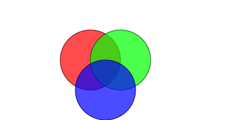

# CairoDart

The goal of this project is to provide Dart language bindings for Cairo 2D graphics library (http://cairographics.org/).<br>
Current binding supports Cairo v1.12.

### Building

First of all you should install Cairo library on your machine.<br>
For installation details see (http://cairographics.org/download/)

CairoDart provides API around native library, so the "glue" code should be compiled before start working with CairoDart.

QMake is used for building native part of cairodart, so it should be installed prior to building.

Also environment variable DART_SDK should be set to location of installed Dart SDK.

```
$ cd native
$ qmake
$ make
```

### Starting unit tests

First start 

```
$ pub get
```

from the root of the project tree.


To start unit tests run following command:

```
$ dart test/all_test.dart
```

### Examples

You can find examples in *example* directory of the project.

Here is an example of CairoDart script that generates several 2D shapes:



```dart
library cairodart.example;

import 'dart:io';
import 'dart:math';

import 'package:cairodart/cairodart.dart';

main() {
  Directory dir = Directory.systemTemp.createTempSync('cairodart');

  var filePath = 'example${Platform.pathSeparator}filled_shapes.png';

  File file = new File(filePath);
  file.createSync();

  Surface surface = new ImageSurface(Format.ARGB32, 400, 200);
  Context ctx = new Context(surface);

  ctx.lineWidth = 1.0;

  // Red circle
  ctx..translate(150, 100)
     ..setSourceRgb(0, 0, 0)
     ..arc(0, 0, 50, 0, 2 * PI)
     ..strokePreserve()
     ..setSourceRgba(1, 0, 0, 0.7)
     ..fill();

  // Green circle
  ctx..translate(50, 0)
    ..setSourceRgb(0, 0, 0)
    ..arc(0, 0, 50, 0, 2 * PI)
    ..strokePreserve()
    ..setSourceRgba(0, 1, 0, 0.7)
    ..fill();

  // Blue circle
  ctx..translate(-25, 50)
    ..setSourceRgb(0, 0, 0)
    ..arc(0, 0, 50, 0, 2 * PI)
    ..strokePreserve()
    ..setSourceRgba(0, 0, 1, 0.7)
    ..fill();

  // Save to png file
  surface.writeTo(filePath);

}
```


Now a little example with transparency:


```dart
library cairodart.example;

import 'dart:io';

import 'package:cairodart/cairodart.dart';

main() {
  Directory dir = Directory.systemTemp.createTempSync('cairodart');

  var filePath = 'example/${Platform.pathSeparator}transparency.png';

  File file = new File(filePath);
  file.createSync();

  Surface surface = new ImageSurface(Format.ARGB32, 350, 350);
  Context ctx = new Context(surface);

  ctx.translate(10, 175);

  for (int i = 0; i < 10; i++) {
    ctx.translate(25, 0);
    var rect = new Rectangle(0, -10, 20, 20);
    ctx.rectangle(rect);
    ctx.setSourceRgba(0, 1, 0, 0.1 * i);
    ctx.fill();
  }

  // Save to png file
  surface.writeTo(filePath);
}
```


### Not implemented features

The first version of CairoDart provides binaries for Linux only.
Binries for Windows and Mac OS will be available in future versions.

The first version of CairoDart does not provide bindings for the following features:
- Xlib Surfaces
- Win32 Surfaces
- XCB Surfaces
- Quartz Surfaces
- XLib-XRender Backend
- Quartz (CGFont) Fonts
- Win32 Fonts
- FreeType Fonts

All these features are expected to be implemented in future versions.

### Bugs

If you find a bug please register new issue with bug description, code example and version of library.<br>
But before you do this please check if this bug is already registered.


### Contribution

Help is much appreciated!<br>
Before submitting pull request please ensure that you changes does not brake old unit tests and covered by new.


